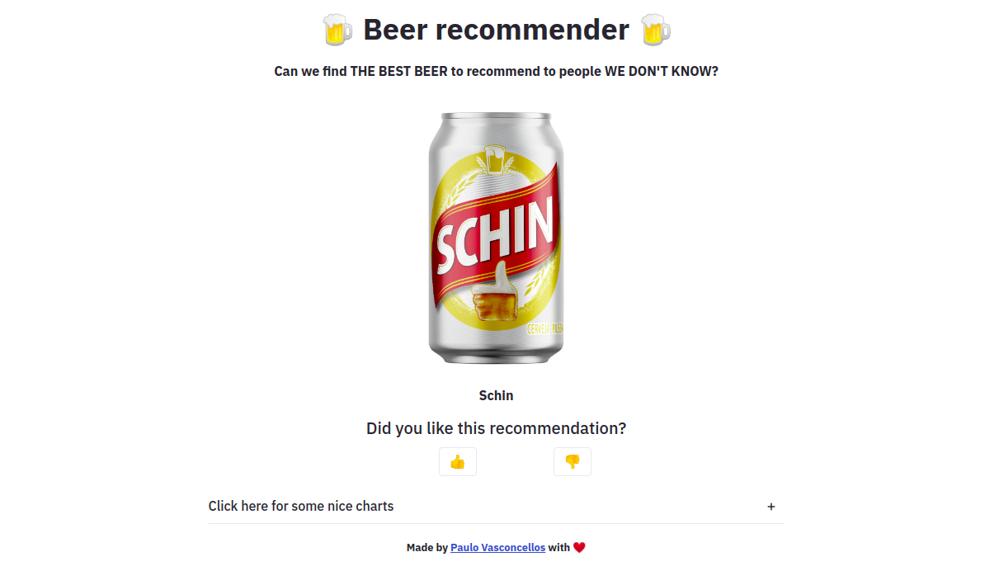
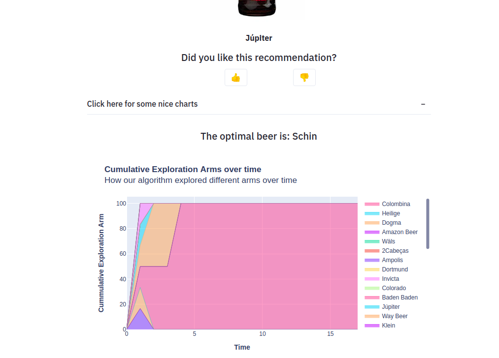
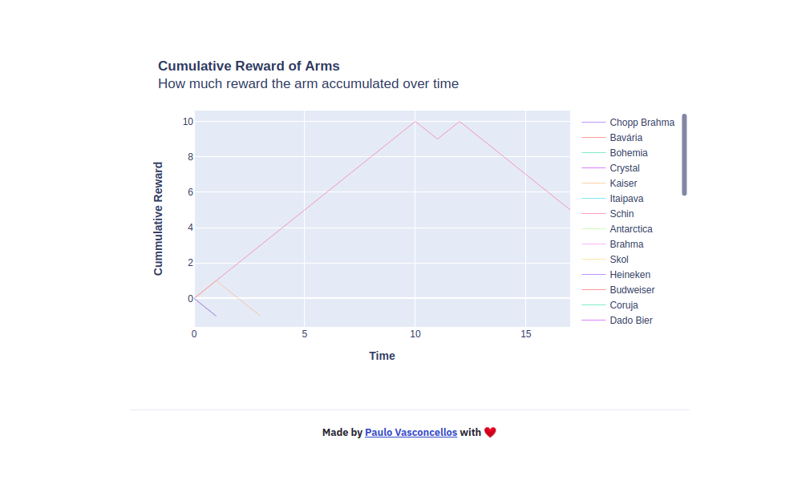

# Beer recommender 🍺
A beer recommendation system using multi-armed bandit (ε-Greedy). This is a just for fun project created in order to **show how we can use reinforcement learning to tackle cold start problems**. Using this project, we want to answer one simple question: **can we find the optimal beer to recommend when we know nothing about a user**?

🚩 The recommendation system contains 37 beers (arms)

# Building the app
To build this app is as easy as run this `docker-compose` command. [Follow this instructions to install docker-compose](https://docs.docker.com/compose/install/), if you don't have it yet.

```
cd beer-recommender-mab
docker-compose up --build
```

# Screenshots
AWS is expensive, so I will not host this project on the cloud. But, here are some nice screenshots tho.

1. First, the recommender. **It will recommend a beer and wait for your feedback** (click the `like` or `dislike` button). The recommendations will follow an [exploration/exploitation](https://towardsdatascience.com/reinforcement-learning-demystified-exploration-vs-exploitation-in-multi-armed-bandit-setting-be950d2ee9f6) policy, which will whether (1) recommend the current optimal beer (exploitation) or (2) it will try to explore different beers and try to find a better option (exploration).




2. By clicking on the "Click here for some nice charts" expander, the app will show some statistics about the current state of the recommender, such as the **cumulative exploration arms over time**.



3. Finally, the **Cumulative reward of each arm** can also be visualized.

